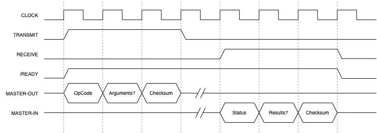

# HDMI Generator Shield for Arduino

#### Inigo Selwood | Master's Project 2022-2023

## Goal

To create a shield for the Arduino Uno capable of driving HDMI displays. The shield will be able to render rasterized text and images, and draw simple vector graphics.

## How it Works

The shield is a PCB that plugs directly into the Arduino Uno. By connecting a display to its HDMI port, the Arduino can be programmed to generate text and graphics. The FPGA can be flashed via the USB-C UART interface. 

The [Arduino API](arduino/) provides a rich feature set for the programmer to use in their graphics applications.

This library is a wrapper for the hardware API, explained [here](#api)

#### Assets

Large assets like font files and images that wouldn't fit in the Arduino's flash memory can be loaded onto the shield from PC via the SD card slot. These assets can then and manipulated from the Arduino to dynamically generate text and display pictures.

#### Surfaces

Surfaces, as referred to in this project, are analogous to textures in traditional graphics hardware. They are persistent and reusable assets which can be drawn on, transformed, blitted, and ultimately rendered on the display.

## Pinout

The shield implements an SPI-based serial interface. The pins as indicated here are numbered as on the Arduino, with pin 1 at the top-left hand side.

Pin | Name       | Function
----|------------|---
2   | /RESET     | Hard resets the shield
3   | +3V3       | -
4   | +5V        | -
5   | GND        | -
6   | GND        | -
16  | /READY     | Signals shield is ready for transmissions
17  | RECEIVE    | Signals shield is responding
18  | TRANSMIT   | Signals Arduino is transmitting
25  | MASTER-OUT | Data from Arduino to the shield
26  | MASTER-IN  | Data from the shield to Arduino
27  | CLOCK      | Serial transmission clock

## API

All transmissions share the same timing. Once the `/READY` signal goes low, the `TRANSMIT` signal can be asserted, and an opcode (with optional arguments) is sent. After a period of time, the `RECEIVE` signal is asserted, and a response is sent from the shield.

The first byte of the response is always a status code, which can be used to signal errors in the packet, or in the execution of the command. 

The last byte of packets both sent and recieved is a checksum. It's the Arduino's responsibility to send a retransmit request if the checksum fails. 

Command             | OpCode |
--------------------|--------|---
Reset               | `0x01` | Soft-resets the shield
Retransmit          | `0x02` | Asks that the last packet transmitted be sent again
Display Connected   | `0x10` | Checks whether a display is plugged in
Load Font           | `0x30` | Loads a font asset from SD memory
Free Font           | `0x3F` | Evicts a font from RAM
Create Surface      | `0x60` | Allocates memory for a surface of a given size
Create Text Surface | `0x61` | Creates a rasterized text surface from a font file
Blit Surface        | `0x62` | Blits two surfaces
Free Surface        | `0x6F` | Frees the memory held by a surface
Draw Point          | `0x80` | Draws a point on a surface
Draw Line           | `0x81` | Draws a line on a surface
Draw Box            | `0x82` | Draws a box on a surface
Render              | `0xF0` | Renders a surface to the display buffer
Clear               | `0xF1` | Clears the display buffer
Update              | `0xF2` | Presents the display buffer